# Hayetak AI Model Diagrams Pack

Generated on: 2026-04-14

This document contains a complete visual set to understand how each AI model works in the project.

## 1) Full AI System Map

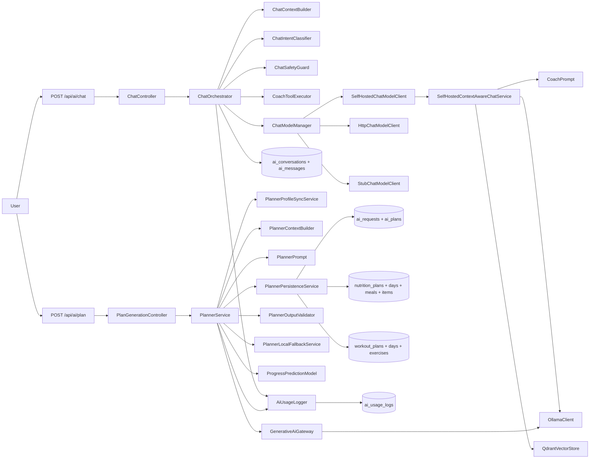

## 2) Chat Model Internals (Component View)

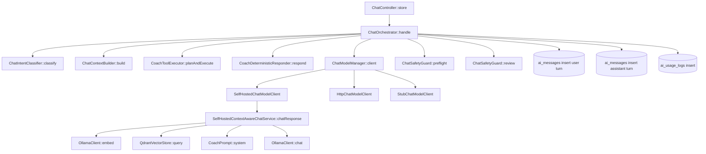

## 3) Chat Request Sequence (Runtime)

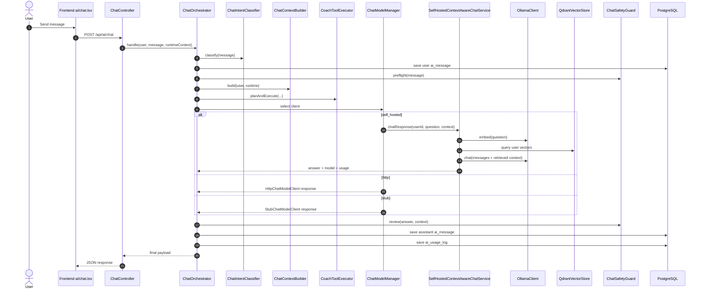

## 4) Chat Provider Selection Decision Tree

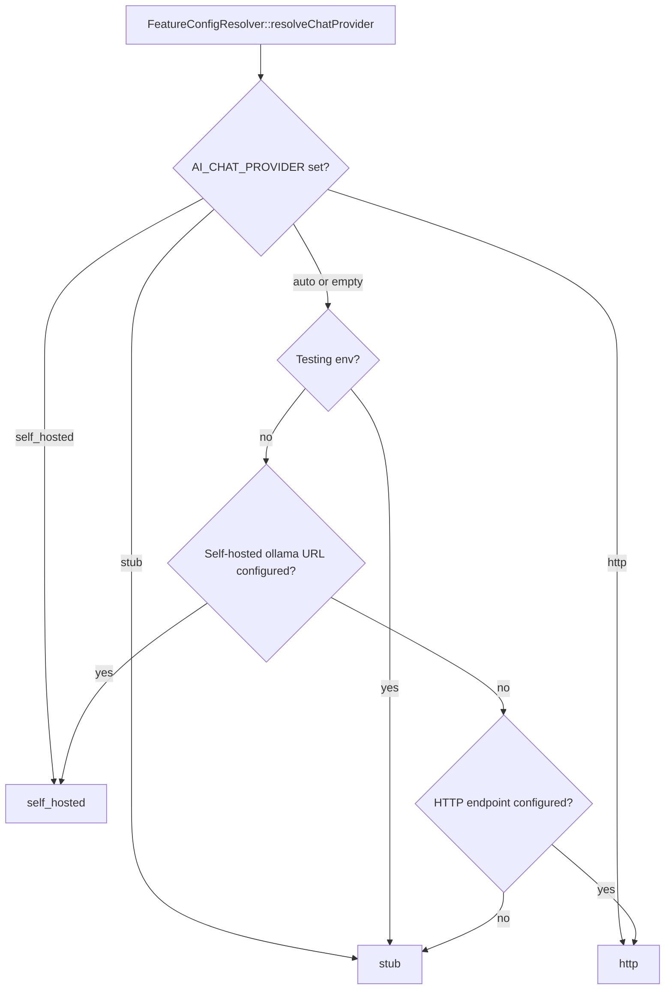

## 5) Chat Safety + Tool Gating

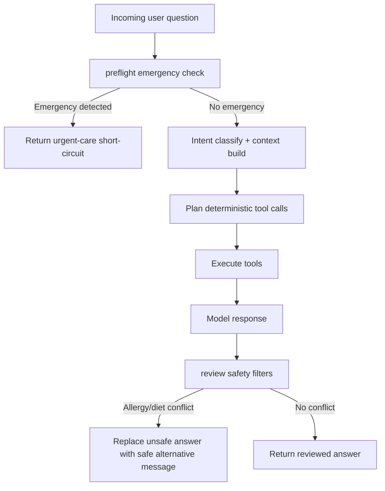

## 6) Planner Model Internals (Component View)

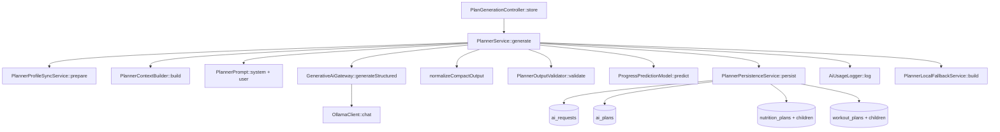

## 7) Planner Generation Sequence (Runtime)

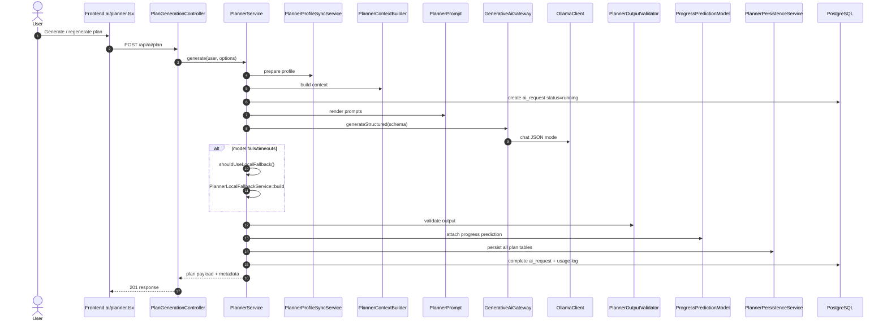

## 8) Planner Fallback Decision Logic

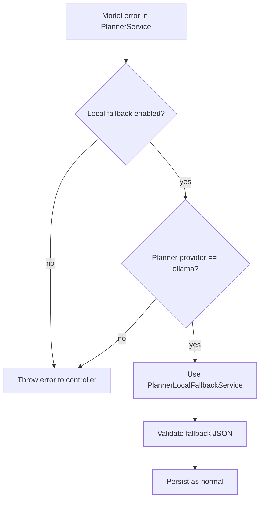

## 9) Progress Prediction Model Logic

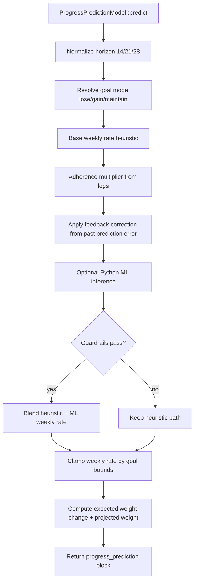

## 10) Progress ML Guardrail Decision Tree

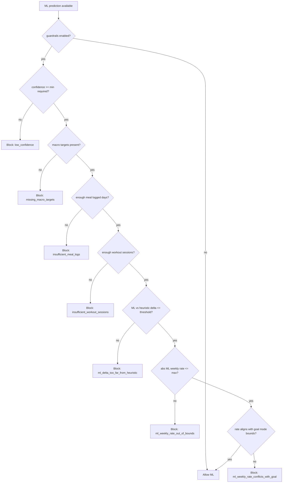

## 11) Data Model ER Diagram (AI + Plan/Log Core)

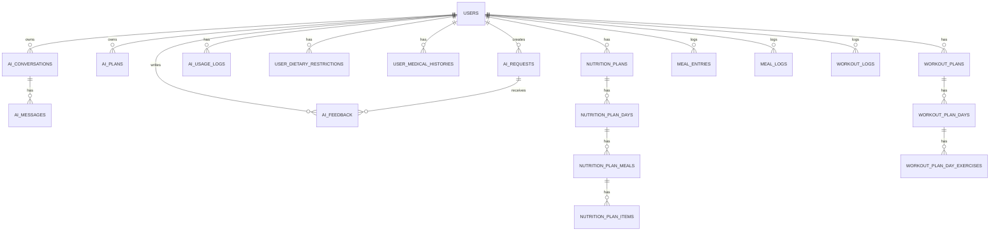

## 12) AI Request Lifecycle State Diagram

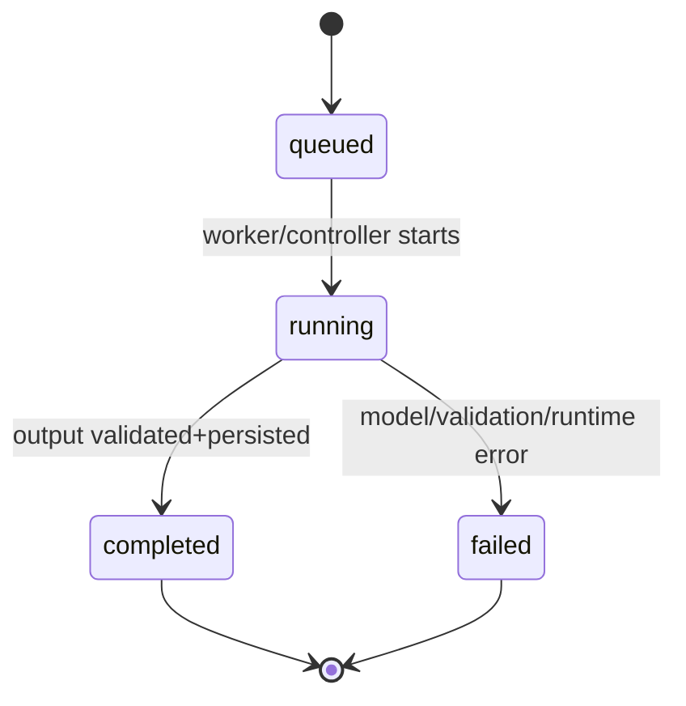

## 13) Chat Conversation Lifecycle State Diagram

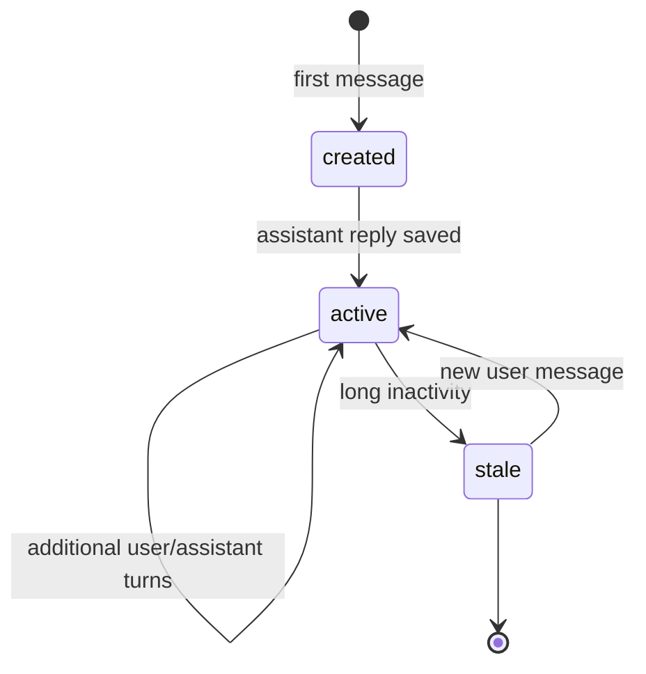

## 14) Context Sync Pipeline (Self-Hosted Retrieval)

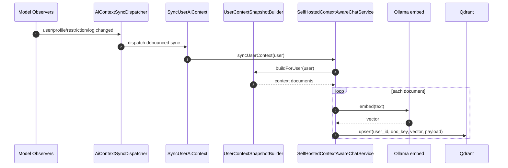

## 15) File Ownership by Model (Quick Visual)

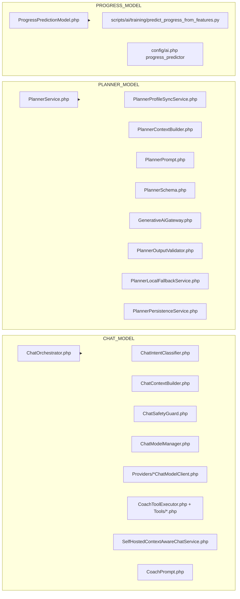
