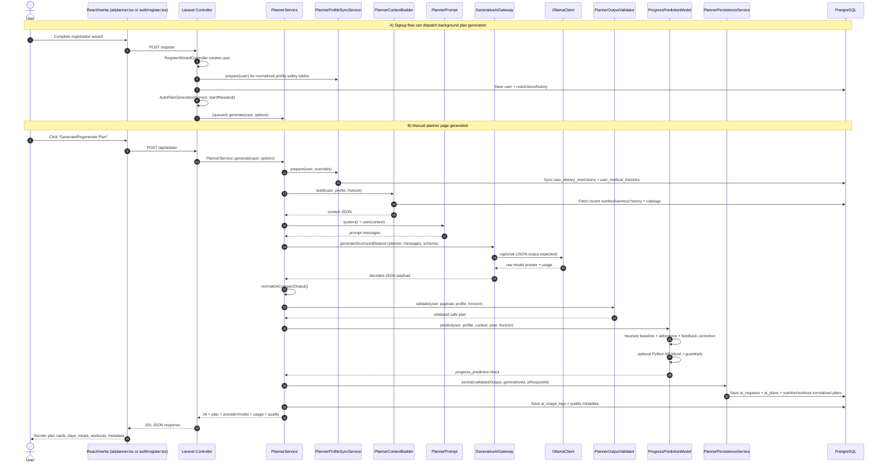
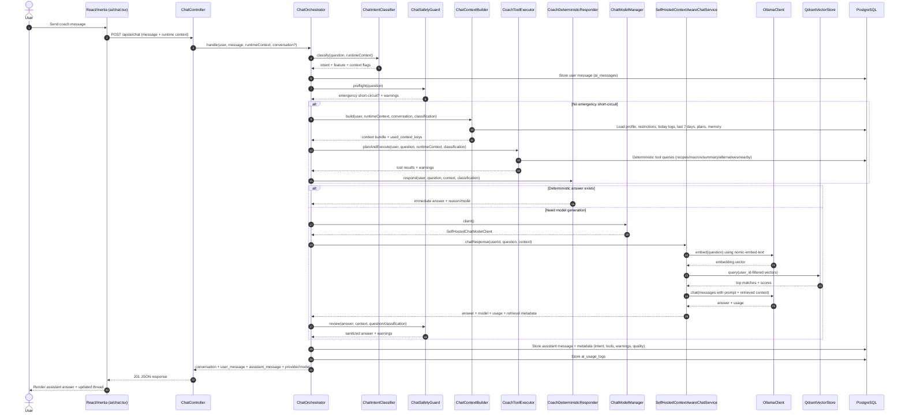
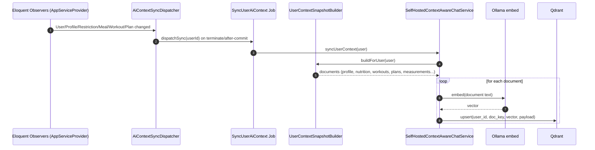

# Hayetak AI Pipelines: Visual Sequence Diagrams

Branch context: `planner_updated`  
Generated: 2026-04-06

This file contains visual sequence diagrams for both AI pipelines:
- Planner pipeline
- Coach pipeline

## 1) Planner Pipeline (Signup + Manual Trigger)

## 2) Coach Pipeline (Context-Aware Chat)

## 3) Context Sync Pipeline (for Self-Hosted Coach Retrieval)

