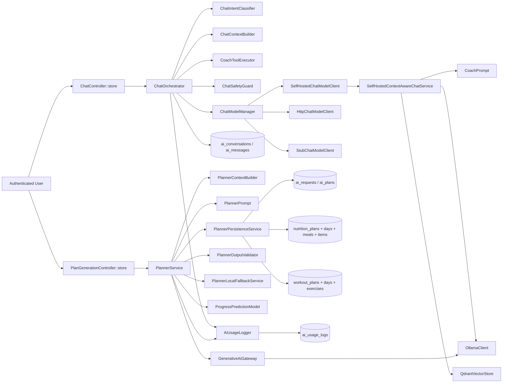

# AI Model Structure Audit (Hayetak)

Generated on: 2026-04-14

## 1) Requested Structure Check

Requirement: `POST /api/ai/plan` exists and stores plan JSON.
Status: ? Implemented.
Evidence: `routes/web.php`, `app/Http/Controllers/Ai/PlanGenerationController.php`, `app/Services/Ai/PlannerService.php`, `app/Services/Ai/Persistence/PlannerPersistenceService.php`.

Requirement: `POST /api/ai/chat` exists and uses profile + restrictions + recent data.
Status: ? Implemented.
Evidence: `routes/web.php`, `app/Http/Controllers/Ai/ChatController.php`, `app/Services/Ai/Chat/ChatContextBuilder.php`, `app/Services/Ai/Chat/ChatSafetyGuard.php`.

Requirement: Coach tools are available (`search_recipes`, `get_day_macros`, `summarize_last_7_days`, `suggest_exercise_alternatives`, `find_gyms_or_nutritionists`).
Status: ? Implemented with exact tool names.
Evidence: `app/Services/Ai/Tools/AiToolRegistry.php` and `app/Services/Ai/Tools/*Tool.php`.

Requirement: hard safety constraints (allergies/diet type/injuries).
Status: ? Implemented at multiple layers.
Evidence: `SearchRecipesTool`, `SuggestExerciseAlternativesTool`, `ChatSafetyGuard`, `PlannerOutputValidator`, `PlannerLocalFallbackService`.

Requirement: today + last 7 days context for coach.
Status: ? Implemented.
Evidence: `ChatContextBuilder`, `GetDayMacrosTool`, `SummarizeLast7DaysTool`.

Requirement: strict JSON planner output schema.
Status: ? Implemented.
Evidence: `PlannerSchema`, `GenerativeAiGateway`, `PlannerOutputValidator`.

Requirement: dedicated tables for restrictions/history/logs/plans/chat sessions/messages.
Status: ? Implemented.
Evidence: migrations listed in section 5.

Requirement: prefer OpenAI Responses API for planner/chat.
Status: ? Not implemented currently.
Current behavior: planner is Ollama-only (`FeatureConfigResolver::provider(planner) => ollama`), chat uses `self_hosted|http|stub`, no OpenAI client path.

Requirement: chat streaming response.
Status: ? Not implemented in current controller endpoint (single JSON response).

## 2) Model Architecture Diagram

## 3) AI Model Files (Chat)

File: `app/Services/Ai/Chat/Contracts/ChatModelClient.php`
Purpose: provider contract (`respond(question, context, options)`).

File: `app/Services/Ai/Chat/ChatModelManager.php`
Purpose: chooses provider implementation from feature config.

File: `app/Services/Ai/Chat/Providers/HttpChatModelClient.php`
Purpose: calls external HTTP chat endpoint, normalizes model/usage/request ID.

File: `app/Services/Ai/Chat/Providers/SelfHostedChatModelClient.php`
Purpose: forwards requests to self-hosted context-aware service; requires `user_id`.

File: `app/Services/Ai/Chat/Providers/StubChatModelClient.php`
Purpose: deterministic local fallback by intent.
Key functions: `respond`, `nutritionReply`, `workoutReply`, `progressReply`, `planReply`, `nearbyReply`, `communicationReply`, `settingsReply`, `wellnessReply`, `generalReply`, `containsAny`.

File: `app/Services/Ai/Chat/SelfHostedContextAwareChatService.php`
Purpose: retrieval-aware self-hosted chat orchestration (embed/search/build prompt/chat).

File: `app/Services/Ai/Runtime/OllamaClient.php`
Purpose: low-level local model client (`embed`, `chat`) for Ollama.

File: `app/Services/Ai/Chat/QdrantVectorStore.php`
Purpose: vector storage/search per-user context documents.

File: `app/Services/Ai/Prompts/CoachPrompt.php`
Purpose: composes system prompt blocks from runtime context/retrieval path/tool outputs.

File: `app/Services/Ai/Prompts/PromptTemplateRepository.php`
Purpose: load/render markdown prompt templates from `resources/ai/prompts/*`.

File: `app/Services/Ai/Chat/ChatOrchestrator.php`
Purpose: main chat execution pipeline (classify -> build context -> tools -> model -> safety -> persist).

File: `app/Services/Ai/Chat/ChatIntentClassifier.php`
Purpose: intent + deterministic action routing + out-of-domain/jailbreak detection.

File: `app/Services/Ai/Chat/ChatContextBuilder.php`
Purpose: merged context (profile/restrictions/today macros/last 7 days/plans/conversation state).

File: `app/Services/Ai/Chat/ChatSafetyGuard.php`
Purpose: preflight emergency short-circuit + post-response safety sanitization.

## 4) AI Model Files (Planner + Predictor)

File: `app/Services/Ai/PlannerService.php`
Purpose: end-to-end planner generation lifecycle.
Major stages: profile sync, context build, prompt build, structured generation, fallback, validation, prediction attach, persistence, usage log.

File: `app/Services/Ai/Runtime/GenerativeAiGateway.php`
Purpose: structured generation gateway; currently supports Ollama path.

File: `app/Services/Ai/Schemas/PlannerSchema.php`
Purpose: strict planner JSON schema definition.

File: `app/Services/Ai/Prompts/PlannerPrompt.php`
Purpose: planner prompt rendering (`system`, `user`).

File: `app/Services/Ai/Validation/PlannerOutputValidator.php`
Purpose: planner safety/completeness checks (targets, meal consistency/variety, food/workout safety, adaptive review).

File: `app/Services/Ai/PlannerLocalFallbackService.php`
Purpose: deterministic no-LLM planner fallback when model fails.

File: `app/Services/Ai/Context/PlannerContextBuilder.php`
Purpose: planner input context (profile + recent history + safety constraints + catalog hints).

File: `app/Services/Ai/Persistence/PlannerPersistenceService.php`
Purpose: transactional save to `ai_plans`, `nutrition_plans`, `workout_plans` and child tables.

File: `app/Services/Ai/Models/ProgressPredictionModel.php`
Purpose: hybrid heuristic + optional trained-model progress prediction.
Key functions: `predict`, `goalMode`, `baseWeeklyRateKg`, `adherenceMultiplier`, `mlBlendGuardrailDecision`, `predictWithTrainedModel`, `buildInferenceFeatureRow`, `recentPredictionErrorPerWeek`, measurement helpers.

File: `app/Services/Ai/Plan/Model/DummyPlanModelClient.php`
Purpose: deterministic dummy plan generator for validation/persistence testing.

## 5) Data Models + Tables Used by AI

Model file: `app/Models/Ai/AiRequest.php`
Table: `ai_requests`.
Purpose: planner/chat request trace (input/output/provider/model/usage/error/status).

Model file: `app/Models/Ai/AiPlan.php`
Table: `ai_plans`.
Purpose: versioned generated diet/workout plan snapshots.

Model file: `app/Models/Ai/AiConversation.php`
Table: `ai_conversations`.
Purpose: chat session/thread metadata.

Model file: `app/Models/Ai/AiMessage.php`
Table: `ai_messages`.
Purpose: chat messages with role + metadata.

Model file: `app/Models/Ai/AiUsageLog.php`
Table: `ai_usage_logs`.
Purpose: token/latency/cost telemetry.

Model file: `app/Models/Ai/AiFeedback.php`
Table: `ai_feedback`.
Purpose: user feedback on AI outputs.

Model file: `app/Models/UserDietaryRestriction.php`
Table: `user_dietary_restrictions`.
Purpose: normalized allergy/diet-type/avoidance records.

Model file: `app/Models/UserMedicalHistory.php`
Table: `user_medical_histories`.
Purpose: normalized medical condition/injury records.

Also used in AI context and tools:
- `app/Models/MealEntry.php` / `meal_entries`
- `app/Models/MealLog.php` / `meal_logs`
- `app/Models/WorkoutLog.php` / `workout_logs`
- `app/Models/NutritionPlan.php` / `nutrition_plans`
- `app/Models/WorkoutPlan.php` / `workout_plans`

## 6) Key Route and Controller Endpoints

Route: `POST /api/ai/chat` (inside authenticated web route group)
Controller: `app/Http/Controllers/Ai/ChatController.php::store`

Route: `POST /api/ai/plan` (inside authenticated web route group)
Controller: `app/Http/Controllers/Ai/PlanGenerationController.php::store`

Note: these are declared in `routes/web.php` under `/api` prefix, not in `routes/api.php`.

## 7) Gaps vs Requested Target

- OpenAI Responses API integration is not present in the current planner/chat execution path.
- Chat endpoint is non-streaming today.
- Nearby tool currently uses local places table and local professionals fallback (no live Places API call in this path).

