# Hayetak AI Model Structure Overview

This diagram shows the main AI model paths in the project: the planner model, the coach chatbot model, and the progress predictor.

```mermaid
flowchart TD
    U["Authenticated user"]

    subgraph Coach["Coach Chatbot"]
        ChatPage["resources/js/pages/ai/chat.tsx"]
        ChatRoutes["routes/web.php<br/>POST /api/ai/chat<br/>POST /api/ai/chat/stream"]
        ChatController["app/Http/Controllers/Ai/ChatController.php"]
        ChatRequest["app/Http/Requests/Ai/StoreChatMessageRequest.php"]
        ChatOrchestrator["app/Services/Ai/Chat/ChatOrchestrator.php"]
        Intent["ChatIntentClassifier<br/>intent + context flags"]
        Safety["ChatSafetyGuard<br/>preflight + answer review"]
        Context["ChatContextBuilder + CoachContextBuilder<br/>profile, restrictions, today, last 7 days, plans"]
        Tools["CoachToolExecutor + AiToolRegistry<br/>recipes, macros, 7-day summary, exercises, nearby"]
        Deterministic["CoachDeterministicResponder<br/>policy/calculator/recipe shortcuts"]
        Manager["ChatModelManager"]
        SelfHosted["SelfHostedChatModelClient<br/>SelfHostedContextAwareChatService"]
        HttpProvider["HttpChatModelClient"]
        StubProvider["StubChatModelClient"]
        Ollama["OllamaClient<br/>llama3.1:8b default"]
        Qdrant["QdrantVectorStore<br/>user-scoped retrieved context"]
        ChatTables["AiConversation + AiMessage + AiUsageLog"]
    end

    subgraph Planner["Planner Model"]
        PlannerPage["resources/js/pages/ai/planner.tsx"]
        PlanRoutes["routes/web.php<br/>POST /api/ai/plan"]
        PlanController["app/Http/Controllers/Ai/PlanGenerationController.php"]
        PlanRequest["app/Http/Requests/Ai/StorePlanRequest.php"]
        PlannerService["app/Services/Ai/PlannerService.php"]
        PlannerContext["PlannerContextBuilder + PlannerProfileSyncService"]
        PlannerPrompt["PlannerPrompt<br/>resources/ai/prompts/planner"]
        Schema["PlannerSchema<br/>strict structured JSON shape"]
        Gateway["GenerativeAiGateway"]
        PlanOllama["OllamaClient<br/>planner model from config/ai.php"]
        Validator["PlannerOutputValidator + plan validators"]
        Fallback["PlannerLocalFallbackService"]
        Persister["PlannerPersistenceService"]
        PlanTables["AiRequest + AiPlan + NutritionPlan + WorkoutPlan"]
    end

    subgraph Predictor["Progress Predictor"]
        PredictorModel["app/Services/Ai/Models/ProgressPredictionModel.php"]
        PythonScript["scripts/ai/training/predict_progress_from_features.py"]
        Artifacts["storage/app/ai/models/*<br/>joblib + manifest.json"]
        PredictionPayload["progress_prediction block<br/>attached to planner output"]
    end

    U --> ChatPage --> ChatRoutes --> ChatController --> ChatRequest --> ChatOrchestrator
    ChatOrchestrator --> Intent
    ChatOrchestrator --> Safety
    ChatOrchestrator --> Context
    ChatOrchestrator --> Tools
    ChatOrchestrator --> Deterministic
    ChatOrchestrator --> Manager
    Manager --> SelfHosted
    Manager --> HttpProvider
    Manager --> StubProvider
    SelfHosted --> Ollama
    SelfHosted --> Qdrant
    ChatOrchestrator --> ChatTables

    U --> PlannerPage --> PlanRoutes --> PlanController --> PlanRequest --> PlannerService
    PlannerService --> PlannerContext
    PlannerService --> PlannerPrompt
    PlannerService --> Schema
    PlannerService --> Gateway --> PlanOllama
    PlannerService --> Fallback
    PlannerService --> Validator
    PlannerService --> PredictorModel
    PlannerService --> Persister --> PlanTables

    PredictorModel --> PythonScript --> Artifacts
    PredictorModel --> PredictionPayload
```

## Notes

- `config/ai.php` is the central switchboard for provider, model names, Ollama URLs, Qdrant settings, token limits, timeouts, rate limits, planner fallback, and progress-predictor guardrails.
- The coach is not a raw model call. It is a guarded pipeline with classification, context assembly, deterministic answers, tools, provider selection, and a final safety review.
- The planner asks the model for strict JSON, normalizes/validates it, attaches progress prediction, and persists separate diet/workout plan records.
- The progress predictor is a hybrid: it always has heuristic logic, and it can blend in Python-trained artifacts only when manifest and runtime guardrails pass.
